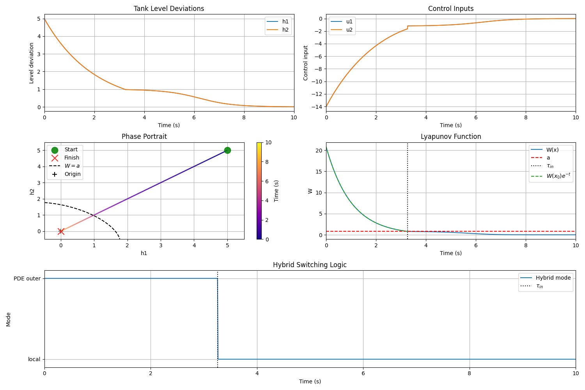
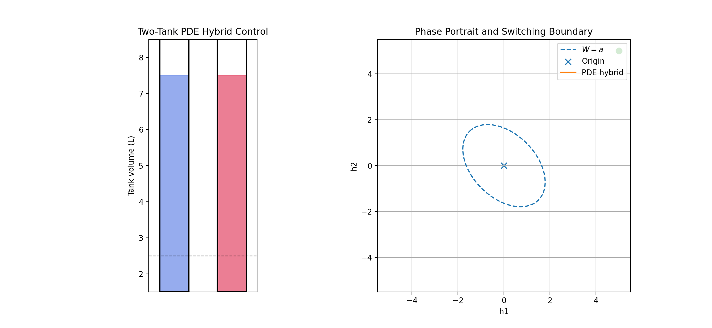
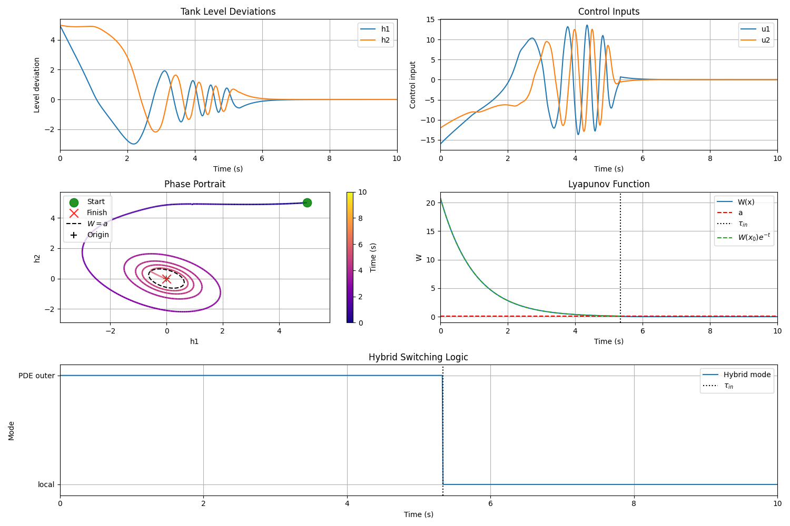
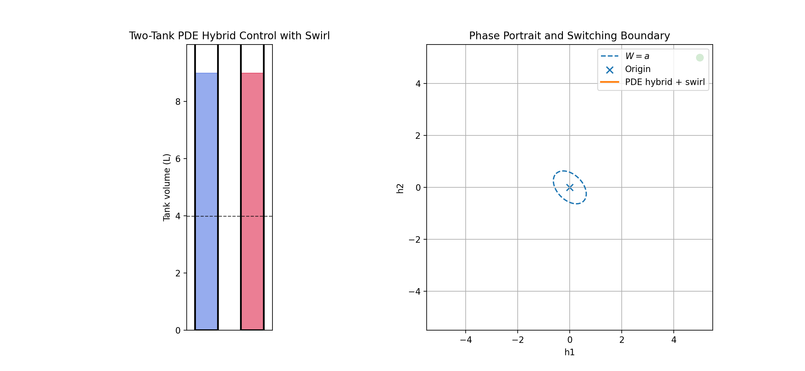
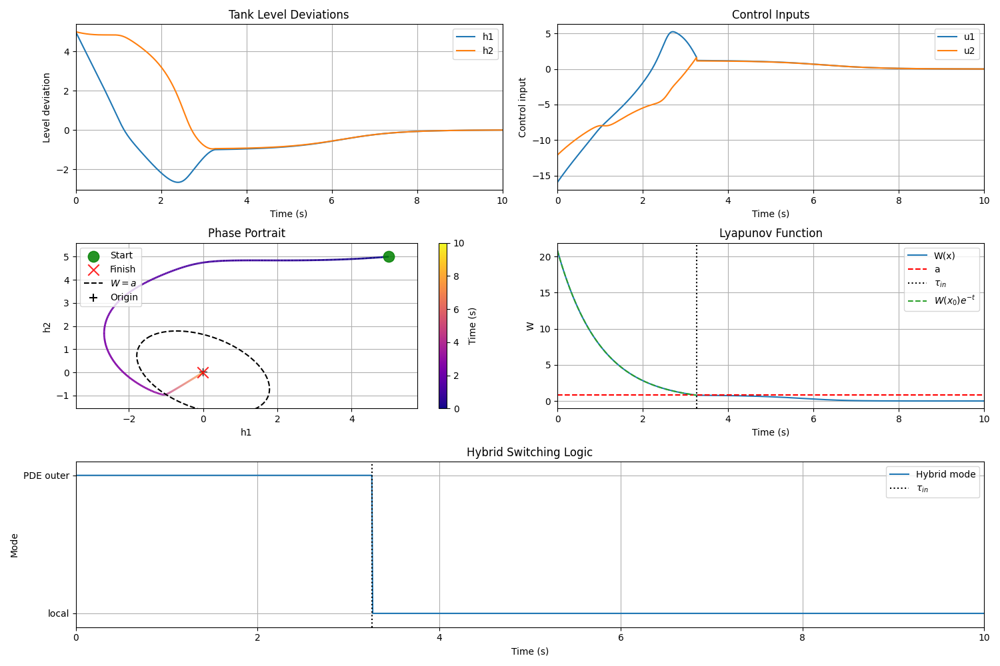
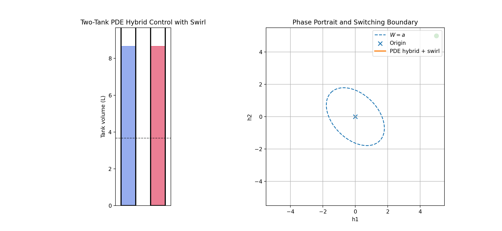

# Two-Tank Hydraulic System Hybrid Lyapunov-PDE Control

This project studies global stabilization of a nonlinear two-tank hydraulic system by a hybrid controller. The inner controller is a local linear stabilizer. The outer controller is a Lyapunov-PDE feedback that drives the state to the inner Lyapunov sublevel set in finite time. A second outer controller adds a tangential swirl term while preserving the same Lyapunov decay law.

<p align="center">
  
</p>
<p align="center">
  <em>Concept animation: the outer controller drives the state toward the switching boundary, then the local controller stabilizes the origin.</em>
</p>

## Problem Definition

The control task is to stabilize the equilibrium

```math
x^\star = 0
```

of a nonlinear two-tank system. The state is

```math
x =
\begin{bmatrix}
h_1 \\
h_2
\end{bmatrix}
\in \mathbb{R}^2,
```

where `h1` and `h2` are deviations of the two liquid levels from a nominal operating point. The control input is

```math
u =
\begin{bmatrix}
u_1 \\
u_2
\end{bmatrix}
\in \mathbb{R}^2,
```

where `u1` and `u2` are controlled inflows into the two tanks.

## System Description

The plant is control-affine:

```math
\dot{x} = f(x) + G(x)u.
```

For this two-tank example,

```math
G(x)=I_2,
```

and

```math
f(x)=
\begin{bmatrix}
\alpha \dfrac{h_1^2}{r^2+h_1^2}h_1 + \kappa(h_2-h_1) \\
\alpha \dfrac{h_2^2}{r^2+h_2^2}h_2 + \kappa(h_1-h_2)
\end{bmatrix}.
```

Notation:

- `alpha > 0`: strength of the destabilizing nonlinear self-inflow term.
- `kappa > 0`: coupling coefficient between the two tanks.
- `r > 0`: saturation scale in the nonlinear term.
- `h1, h2`: tank-level deviations.
- `u1, u2`: control inflows.

## Mathematical Specification

The linearization at the origin is

```math
A =
\begin{bmatrix}
-\kappa & \kappa \\
\kappa & -\kappa
\end{bmatrix},
\qquad
B = I_2.
```

The local feedback is

```math
u_{\mathrm{loc}}(x)=Kx,
\qquad
K=-kI_2,\quad k>0.
```

The closed-loop linearization is

```math
A_{\mathrm{cl}}=A+BK.
```

Its eigenvalues are `-k` and `-(2 kappa + k)`, so `A_cl` is Hurwitz for every `k > 0`. The quadratic Lyapunov matrix `P` is computed from

```math
A_{\mathrm{cl}}^\top P + P A_{\mathrm{cl}} = -I.
```

For the two-tank structure this gives

```math
P =
\frac{1}{2k(2\kappa+k)}
\begin{bmatrix}
\kappa+k & \kappa \\
\kappa & \kappa+k
\end{bmatrix}.
```

The Lyapunov function used in the code is

```math
W(x)=x^\top P x.
```

The inner and outer regions are

```math
\Omega_a = \{x\in\mathbb{R}^2 : W(x)\le a\},
\qquad
D_a = \{x\in\mathbb{R}^2 : W(x)>a\}.
```

The switching surface is

```math
\Sigma_a = \{x\in\mathbb{R}^2 : W(x)=a\}.
```

In the outer region define

```math
T(x)=\log\frac{W(x)}{a},
\qquad
\nabla T(x)=\frac{\nabla W(x)}{W(x)}.
```

Since `G(x)=I_2`, the outer PDE controller is

```math
u_{\mathrm{ext}}(x)
=
-\frac{W(x)+\nabla W(x)^\top f(x)}
{\|\nabla W(x)\|^2}\nabla W(x),
\qquad x\in D_a.
```

This controller enforces

```math
\nabla T(x)^\top(f(x)+u_{\mathrm{ext}}(x))=-1,
```

which is equivalent to

```math
\dot{W}(x)=-W(x)
```

in the outer region. Therefore, while the trajectory stays in `D_a`,

```math
W(x(t)) = W(x_0)e^{-t}.
```

The theoretical entrance time into `Sigma_a` is

```math
\tau_{\mathrm{in}}(x_0)
=
\log\frac{W(x_0)}{a}.
```

The README gives the concise derivation needed to understand the implementation. A longer mathematical appendix with all proofs can be viewed in `math_appendix.pdf'.

## Swirl Outer Controller

The swirl controller keeps the same Lyapunov decay law but changes the path in the phase plane.

Let

```math
g(x)=\nabla T(x),
\qquad
g^\perp(x)=
\begin{bmatrix}
-g_2(x) \\
g_1(x)
\end{bmatrix}.
```

Since `g(x)^T g^\perp(x)=0`, the tangential component does not change the transport-PDE identity. The implemented swirl control is

```math
u_{\mathrm{sw}}(x)
=
u_{\mathrm{ext}}(x)
+ \omega(x)g^\perp(x),
```

where

```math
\omega(x)
=
\beta \frac{\max(W(x)-a,0)}{W(x)+\varepsilon}.
```

Here `beta` is `swirl_gain` in code and `epsilon` is a small numerical regularization.

Because the swirl term is tangent to the level sets of `T` and `W`, it preserves

```math
\dot{W}(x)=-W(x)
```

outside the switching surface. Its purpose is visualization and trajectory shaping, not changing the certified radial Lyapunov decrease.

## Hybrid Control Law

For both the regular and swirl variants, the hybrid controller applies

```math
u(x)=
\begin{cases}
u_{\mathrm{outer}}(x), & W(x)>a,\\
u_{\mathrm{loc}}(x), & W(x)\le a,
\end{cases}
```

where `u_outer` is either `u_ext` or `u_sw`.

The explicit regular hybrid controller is

```math
u_{\mathrm{hyb}}(x)=
\begin{cases}
-\dfrac{W(x)+\nabla W(x)^\top f(x)}
{\|\nabla W(x)\|^2}\nabla W(x),
& W(x)>a,\\[3mm]
Kx,
& W(x)\le a.
\end{cases}
```

The explicit swirl hybrid controller is

```math
u_{\mathrm{hyb}}^{\mathrm{sw}}(x)=
\begin{cases}
-\dfrac{W(x)+\nabla W(x)^\top f(x)}
{\|\nabla W(x)\|^2}\nabla W(x)
+\omega(x)
\begin{bmatrix}
-\partial_{h_2}T(x)\\
\partial_{h_1}T(x)
\end{bmatrix},
& W(x)>a,\\[5mm]
Kx,
& W(x)\le a,
\end{cases}
```

with

```math
\omega(x)=\beta\frac{\max(W(x)-a,0)}{W(x)+\varepsilon}.
```

Here `beta` is `swirl_gain`, `epsilon` is the small numerical regularization, and `K=-kI_2`.

The theory assumes that the chosen level `a` is small enough for the local Lyapunov decrease condition to hold in `Omega_a`.

## Algorithm Listing

For one simulation run:

1. Build the two-tank plant with `alpha`, `kappa`, and `r`.
2. Linearize the plant at `x = 0` to obtain `A` and `B`.
3. Choose `K = -kI_2`.
4. Compute `A_cl = A + BK` and verify that it is Hurwitz.
5. Solve `A_cl^T P + P A_cl = -I`.
6. Define `W(x)=x^T P x` and the switching level `a`.
7. Build the local controller `u_loc(x)=Kx`.
8. Build either the regular outer controller `u_ext` or the swirl outer controller `u_sw`.
9. At each integration step:
   - compute `W(x)`;
   - if `W(x)>a`, apply the selected outer controller;
   - otherwise apply `u_loc`.
10. Integrate the closed-loop dynamics with fixed-step RK4.

## Reproducibility

Install dependencies:

```bash
pip install -r requirements.txt
```

Run the regular hybrid controller:

```bash
python3 two_tank_hybrid.py
```

Run the hybrid controller with swirl:

```bash
python3 two_tank_swirl.py
```

## Results Summary

The final results demonstrate the following claims:

1. The regular PDE hybrid controller drives the trajectory from a large initial condition into `Omega_a` and then to the origin.
2. During the outer phase, `W(x(t))` follows the theoretical exponential curve `W(x_0)e^{-t}` up to numerical integration error.
3. The swirl controller changes the visible phase plane path while preserving the same Lyapunov decay law.
4. Novel method was proved theoretically and practically
   
<p align="center">
  
</p>
<p align="center">
  <em>Regular PDE hybrid controller: state trajectories, control inputs, phase portrait, Lyapunov decay, and switching mode.</em>
</p>

<p align="center">
  
</p>
<p align="center">
  <em>Animation for hybrid controller without swirl.</em>
</p>


<p align="center">
  
</p>
<p align="center">
  <em>Swirl PDE hybrid controller with small switching level `a=0.1`: the outer swirling motion remains active longer before switching to the local stabilizer.</em>
</p>

<p align="center">
  
</p>
<p align="center">
  <em>Animation for `a=0.1`: the switching boundary is smaller, so the outer swirl phase persists longer.</em>
</p>


<p align="center">
  
</p>
<p align="center">
  <em>Swirl PDE hybrid controller with larger switching level `a=0.8`: the trajectory enters the local region earlier.</em>
</p>

<p align="center">
  
</p>
<p align="center">
  <em>Animation for `a=0.8`: the switching boundary is larger, so the local stabilizer takes over earlier.</em>
</p>

## Code Structure

```text
.
├── README.md
├── requirements.txt
├── configs/
│   └── default.json
├── figures/
│   ├── hybrid_control/
│   ├── swirl_control_small_a/
│   └── swirl_control_big_a/
├── animations/
│   ├── idea.gif
│   ├── hybrid_control/
│   ├── swirl_control_small_a/
│   └── swirl_control_big_a/
├── two_tank_hybrid.py
├── two_tank_swirl.py
└── src/
    ├── cli.py
    ├── core/
    │   ├── interfaces.py
    │   └── types.py
    ├── systems/
    │   └── two_tank.py
    ├── lyapunov/
    │   └── quadratic.py
    ├── controllers/
    │   ├── local.py
    │   ├── outer.py
    │   ├── swirl.py
    │   └── hybrid.py
    ├── simulation/
    │   ├── rk4.py
    │   └── simulator.py
    ├── experiments/
    │   ├── config.py
    │   └── two_tank_setup.py
    └── visualization/
        └── two_tank.py
```

Module responsibilities:

- `core/`: abstract interfaces and shared array typing helpers.
- `systems/`: the two-tank plant and its linearization.
- `lyapunov/`: construction of the quadratic Lyapunov matrix and `W(x)`.
- `controllers/`: local, PDE outer, swirl outer, and hybrid switching controllers.
- `simulation/`: RK4 integration and closed-loop simulation result containers.
- `experiments/`: default parameters and setup factories.
- `visualization/`: plots, phase portraits, mode plots, and GIF animation helpers.
- root scripts: reproducible command-line entry points.
- `configs/default.json`: default experiment parameters recorded in a course-template-friendly format.
- `figures/`: generated static plots.
- `animations/`: generated GIF animations.
