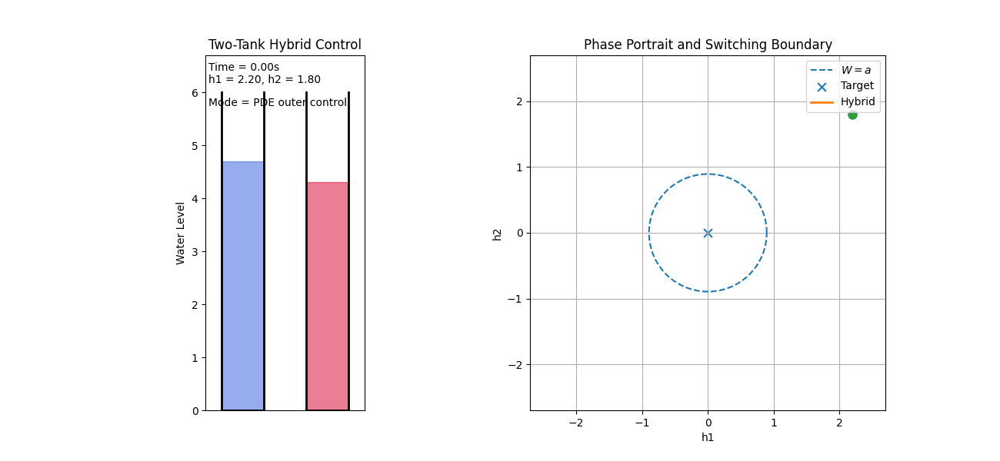
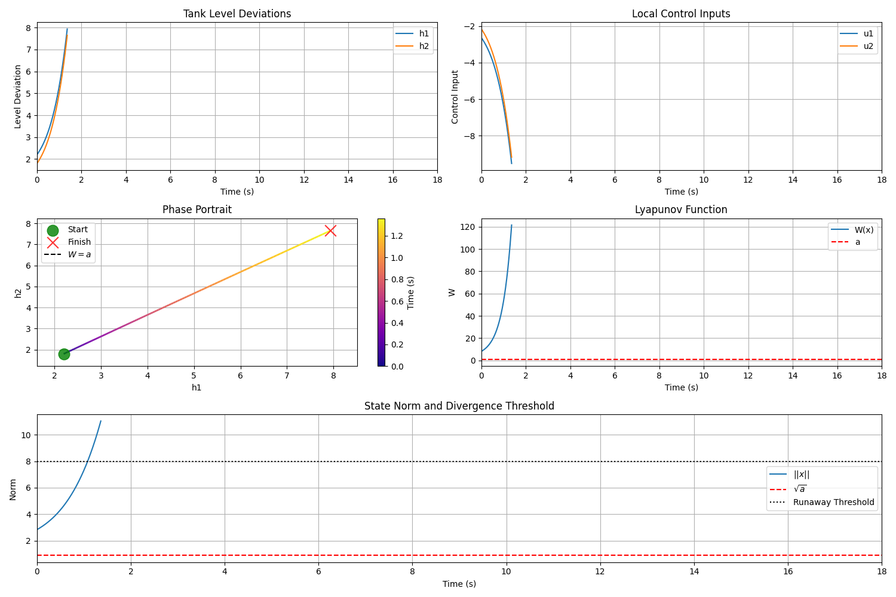
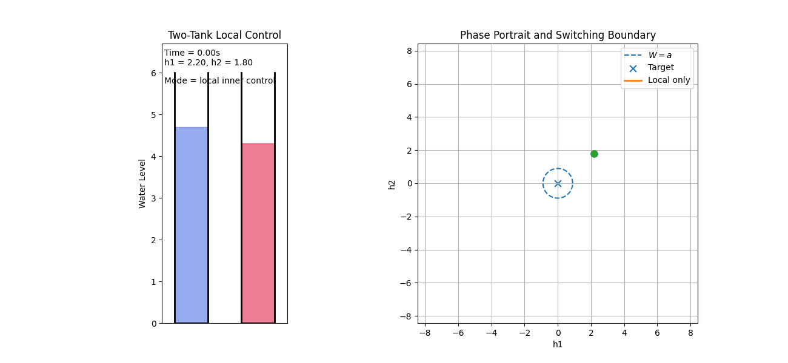
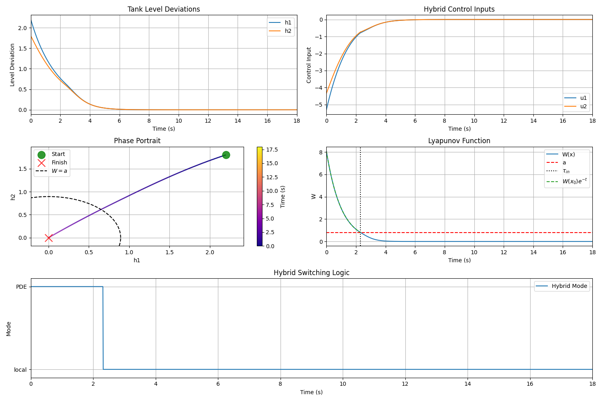
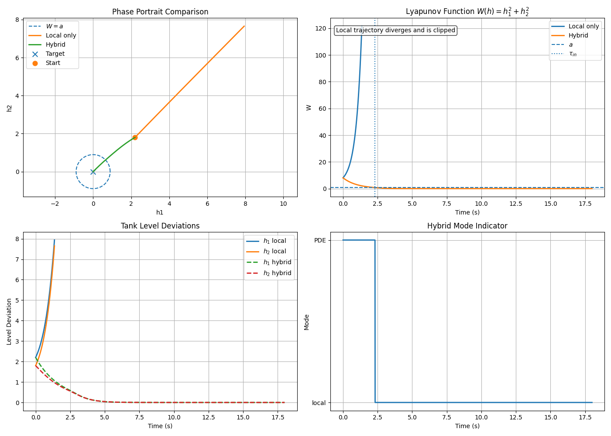
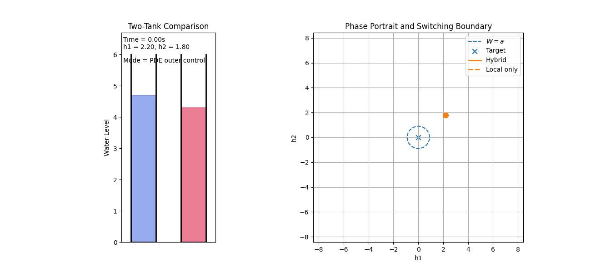

# Two-Tank Hydraulic System Hybrid Control

This repository implements a local-global hybrid controller for a nonlinear two-tank hydraulic system. The presentation and artifact layout follow the same style as the Acrobot repository, but all mathematics, control laws, and simulation outputs here are derived from the two-tank model and the hybrid stabilization proof in `converse_control.pdf`.

<p align="center">
  
</p>
<p align="center">
  <em>Hybrid stabilization of the two-tank system: PDE outer control drives the state into the Lyapunov sublevel set, then local linear feedback completes convergence</em>
</p>

## Overview

The plant state is

```math
x = \begin{bmatrix} h_1 \\ h_2 \end{bmatrix},
```

where `h1` and `h2` are deviations of tank levels from the nominal operating point. The nonlinear dynamics are

```math
\dot{x} = f(x) + u,
```

with

```math
f(x) =
\begin{bmatrix}
\alpha \dfrac{h_1^2}{r^2 + h_1^2} h_1 + \kappa(h_2 - h_1) \\
\alpha \dfrac{h_2^2}{r^2 + h_2^2} h_2 + \kappa(h_1 - h_2)
\end{bmatrix}.
```

The challenge is that the destabilizing nonlinear inflow term dominates for large level deviations, so a purely local linear controller cannot guarantee global convergence.

**Control strategy**

1. **Local linear control**: `u_loc(x) = -k x` stabilizes the origin in a neighborhood.
2. **PDE-based outer control**: `u_ext(x)` enforces `\dot{W} = -W` outside the inner region.
3. **Hybrid switching**: the controller uses `u_ext` while `W(x) > a` and switches to `u_loc` once the state enters `W(x) <= a`.

## Quick Start

### Installation

```bash
pip install -r requirements.txt
```

### Running the Simulations

```bash
# Local linear controller only
python two_tank_local.py

# Hybrid controller with PDE outer law
python two_tank_hybrid.py

# Side-by-side comparison of local vs hybrid
python two_tank_comparison.py
```

All generated artifacts are saved under `gfx/`.

## Technical Background

### Lyapunov Function

The quadratic Lyapunov function used in the proof and code is

```math
W(x) = h_1^2 + h_2^2.
```

The switching boundary is the circle

```math
\Omega_a = \{x \in \mathbb{R}^2 : W(x) \le a\}, \quad a = 0.8.
```

### Local Controller

Inside `\Omega_a`, the system uses

```math
u_{loc}(x) = -k x.
```

This controller is locally asymptotically stabilizing because the linearized closed-loop matrix is Hurwitz. However, on the invariant line `h_1 = h_2 = s`, the scalar dynamics become

```math
\dot{s} =
\left(
\alpha \frac{s^2}{r^2 + s^2} - k
\right) s,
```

so for large `|s|` and `\alpha > k`, the local controller alone is not globally stabilizing.

### PDE-Based Outer Controller

Outside `\Omega_a`, the external controller is

```math
u_{ext}(x) =
-\frac{W(x) + \nabla W(x)^\top f(x)}{\|\nabla W(x)\|^2} \nabla W(x),
\qquad x \ne 0.
```

For `W(x) = h_1^2 + h_2^2`, this guarantees

```math
\dot{W}(x(t)) = -W(x(t)),
```

which implies the exact decay law

```math
W(x(t)) = W(x_0)e^{-t}.
```

Therefore the theoretical entrance time into the inner region is

```math
\tau_{in}(x_0) = \log\left(\frac{W(x_0)}{a}\right).
```

This is the central result proven in `converse_control.pdf` and mirrored in [README-derivation.md](README-derivation.md).

## Control Strategy in Detail

### 1. Local Inner Region

If `W(x) <= a`, the controller applies

```math
u(x) = u_{loc}(x).
```

The inner region is positively invariant under the local law.

### 2. Outer PDE Region

If `W(x) > a`, the controller applies

```math
u(x) = u_{ext}(x).
```

This makes the state contract exponentially toward the boundary `W = a`.

### 3. Hybrid Switching Logic

The full hybrid law is

```math
u(x) =
\begin{cases}
u_{ext}(x), & W(x) > a, \\
u_{loc}(x), & W(x) \le a.
\end{cases}
```

In the implementation, the active mode is stored and plotted over time so the transition from PDE outer control to local feedback is visible in the result figures.

## Experiments Definition

### Local Control Only

This experiment runs only the local linear stabilizer from the initial condition `x0 = [2.2, 1.8]^T`.

<p align="center">
  
  
</p>
<p align="center">
  <em>Local control only: the trajectory is stabilized near the origin in theory, but diverges from this large initial condition</em>
</p>

### Hybrid Control

This experiment applies the PDE outer law until the trajectory enters `W(x) <= a`, then switches to the local controller.

<p align="center">
  
  
</p>
<p align="center">
  <em>Hybrid control: exact Lyapunov decay in the outer region and asymptotic convergence after switching to the inner controller</em>
</p>

### Comparative Analysis

The comparison script is based on the combined local+hybrid simulation logic from `code.txt`, but refactored into the repository and rendered in the same output style as the Acrobot project.

<p align="center">
  
  
</p>
<p align="center">
  <em>Direct comparison: local feedback diverges from the chosen initial condition, while the hybrid law reaches the inner Lyapunov level set in finite time and converges to the origin</em>
</p>

## Results and Discussion

### What Works Well

1. **Finite-time entrance into the inner region**: in simulation, the hybrid controller reaches `W(x) <= a` at a time that matches the theoretical value `\tau_{in} = \log(W(x_0)/a)` up to numerical discretization.
2. **Global practical behavior from large initial conditions**: unlike the local controller, the hybrid law remains bounded and converges from `x0 = [2.2, 1.8]^T`.
3. **Exact outer-region Lyapunov shaping**: the PDE control law enforces the exponential law `W(t) = W(x_0)e^{-t}` while the trajectory stays outside the inner set.
4. **Clear experiment artifacts**: plots and animations are now saved automatically into `gfx/local_control`, `gfx/hybrid_control`, and `gfx/comparison`.

### Current Limitations

1. **Simple RK4 integrator**: the simulation uses a fixed-step RK4 method, which is sufficient here but not as robust as adaptive solvers for stiff or more extreme regimes.
2. **Hard divergence clipping**: the local-only simulation is truncated when the state exceeds `STATE_MAX`, so the plot visualizes divergence safely rather than letting the numerics blow up.
3. **No parameter sweep**: the repository demonstrates the theory for one nominal parameter set and one representative initial condition.

### Why Hybrid Beats Local

The local controller fails because its stabilizing action is only guaranteed in a neighborhood of the origin. The outer PDE law fixes exactly that gap: it constructs a directional control action that forces the quadratic Lyapunov function to decay exponentially until the system is handed off to the local stabilizer.

## Code Structure

The repository is organized the same way as the Acrobot project: a shared model module plus dedicated experiment entry points.

- [common.py](common.py): system parameters, nonlinear drift, local/PDE/hybrid laws, RK4 integration, plotting helpers, and animation utilities
- [two_tank_local.py](two_tank_local.py): local-only experiment and artifact generation
- [two_tank_hybrid.py](two_tank_hybrid.py): hybrid experiment and artifact generation
- [two_tank_comparison.py](two_tank_comparison.py): combined local-vs-hybrid plots and animation derived from `code.txt`
- [README-derivation.md](README-derivation.md): detailed mathematical derivation and proof

## Mathematical Details

For the full proof of global asymptotic stability and the explicit derivation of the outer control law, see:

- [README-derivation.md](README-derivation.md)
- `C:\Users\user\Downloads\acrobot-friction-adaptive-control-main\converse_control.pdf`

## References

1. The local proof notes in `converse_control.pdf`.
2. The repository derivation in [README-derivation.md](README-derivation.md).
